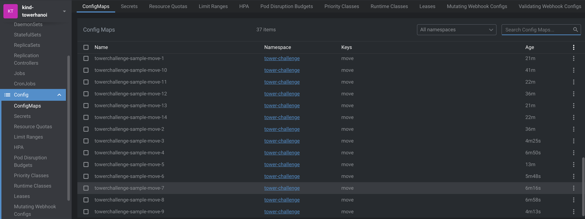
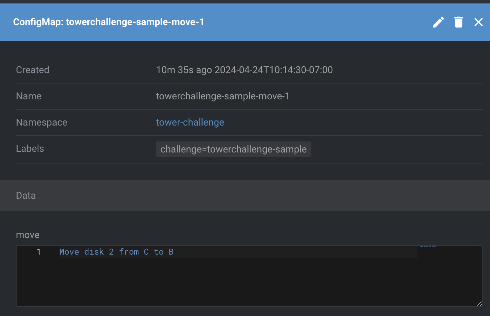

# Towers-of-Hanoi Kubernetes Integration Documentation

This document provides a comprehensive guide on setting up and deploying a Towers of Hanoi challenge within a Kubernetes environment, leveraging the Crossplane control plane to manage custom resources and compositions.

## Overview

The project involves deploying a Kubernetes-based solution for managing the "Tower of Hanoi" puzzle. It includes creating a custom Kubernetes controller, defining the necessary Custom Resource Definitions (CRDs), and configuring Crossplane compositions to facilitate the orchestration and operational management of puzzle instances.

## Step 1: Setting Up a Kubernetes Cluster

### Initial Setup

For development and testing, a local Kubernetes cluster is set up using Minikube. This involves installing virtualization tools and Minikube itself.

1. **Virtualization Environment Setup**:

   - Verify and set up a virtualization tool like VirtualBox.

2. **Minikube Installation**:
   - Follow the installation guide on the [Minikube GitHub page](https://github.com/kubernetes/minikube).

### Start and Verify the Minikube Cluster

- Start Minikube with Docker as the driver and verify that the cluster is operational by checking the status of the nodes.

```bash
minikube start --driver=docker
kubectl get nodes
```

## Step 2: Install and Set Up Crossplane

### Crossplane Installation

Install Crossplane using Helm by adding the stable repository, updating it, and then deploying Crossplane into the Kubernetes cluster.

```bash
helm repo add crossplane-stable https://charts.crossplane.io/stable
helm repo update
helm install crossplane crossplane-stable/crossplane --namespace crossplane-system --create-namespace
```

### Verify Crossplane Installation

Ensure that all Crossplane components are running correctly in the `crossplane-system` namespace.

```bash
kubectl get all -n crossplane-system
```

## Step 3: Implement Tower of Hanoi Logic with CRDs and Controller

### Custom Resource Definition (CRD)

- The `TowerChallenge` CRD is introduced to manage the lifecycle of the Tower of Hanoi challenges within the cluster.

### Apply the CRD

Deploy the CRD to the Kubernetes cluster:

```bash
kubectl apply -f towerchallenge.yaml
```

## Step 4: Controller Implementation

### TowerChallengeReconciler

This custom Kubernetes controller orchestrates the resolution of the Tower of Hanoi puzzle. It handles resource lifecycle management, including the creation, update, and cleanup of associated ConfigMaps.

### Key Features

- **Reconciliation Logic**: Manages the initialization, move calculation, and cleanup of resources.
- **Validation**: Ensures valid puzzle configurations.
- **ConfigMap Management**: Updates and creates ConfigMaps as needed.

## Step 5: Crossplane Composition Setup

### Composition Definition

Defines how the `CompositeResourceTowerChallenge` is composed of underlying resources, specifically focusing on managing puzzle instances and associated logging configurations.

### Deployment and Configuration

Deploy and configure the composition to link challenge instances with their logging mechanisms, ensuring comprehensive management and observability.

```bash
kubectl apply -f composition.yaml
```

## Result:

I have written a custom operator that leverages Crossplane Resources Definitions and Compositions and Composition Resources and Claims to generate config maps after calculating the number of moves to solve the Hanoi Tower puzzle problem. For every disc moved it generates a config maps like the ones in the image below on my local cluster.




### TowerSamples: 

From this point, I have also had it create a Composition Resource Definition called TowerSamples to record the process of how long it took to produce the ConfigMaps the names of all the configmaps generated, and a clean up of configmaps in the case that the claim defines for the system to reduce the number of discs. I have made sure that it would calculate the number of config maps and generate them only the ones needed and update the messages of disc moved or reduce the ones that would give us a wrong solution.

```yaml
apiVersion: webapp.hanoi.com/v1alpha1
kind: TowerChallenge
metadata:
  annotations:
    kubectl.kubernetes.io/last-applied-configuration: >
      {"apiVersion":"webapp.hanoi.com/v1alpha1","kind":"TowerChallenge","metadata":{"annotations":{},"labels":{"app.kubernetes.io/managed-by":"kustomize","app.kubernetes.io/name":"towerofhanoi"},"name":"towerchallenge-sample","namespace":"tower-challenge"},"spec":{"discs":4}}
  creationTimestamp: "2024-04-21T18:38:01Z"
  generation: 6
  labels:
    app.kubernetes.io/managed-by: kustomize
    app.kubernetes.io/name: towerofhanoi
  managedFields:
    - apiVersion: webapp.hanoi.com/v1alpha1
      fieldsType: FieldsV1
      fieldsV1:
        f:metadata:
          f:annotations:
            .: {}
            f:kubectl.kubernetes.io/last-applied-configuration: {}
          f:labels:
            .: {}
            f:app.kubernetes.io/managed-by: {}
            f:app.kubernetes.io/name: {}
        f:spec:
          .: {}
          f:discs: {}
      manager: kubectl-client-side-apply
      operation: Update
      time: "2024-04-22T06:30:21Z"
    - apiVersion: webapp.hanoi.com/v1alpha1
      fieldsType: FieldsV1
      fieldsV1:
        f:status:
          .: {}
          f:configMapsCreated: {}
          f:phase: {}
      manager: main
      operation: Update
      subresource: status
      time: "2024-04-22T09:40:00Z"
    - apiVersion: webapp.hanoi.com/v1alpha1
      fieldsType: FieldsV1
      fieldsV1:
        f:status:
          f:configMapNames: {}
          f:endTime: {}
          f:startTime: {}
          f:steps: {}
      manager: manager
      operation: Update
      subresource: status
      time: "2024-04-24T12:19:03Z"
  name: towerchallenge-sample
  namespace: tower-challenge
  resourceVersion: "644040"
  uid: 71f0ad7f-56d1-4c42-961e-60cdcda95380
  selfLink: >-
    /apis/webapp.hanoi.com/v1alpha1/namespaces/tower-challenge/towerchallenges/towerchallenge-sample
status:
  configMapNames:
    - towerchallenge-sample-move-1
    - towerchallenge-sample-move-2
    - towerchallenge-sample-move-3
    - towerchallenge-sample-move-4
    - towerchallenge-sample-move-5
    - towerchallenge-sample-move-6
    - towerchallenge-sample-move-7
    - towerchallenge-sample-move-8
    - towerchallenge-sample-move-9
    - towerchallenge-sample-move-10
    - towerchallenge-sample-move-11
    - towerchallenge-sample-move-12
    - towerchallenge-sample-move-13
    - towerchallenge-sample-move-14
    - towerchallenge-sample-move-15
  configMapsCreated: true
  endTime: "2024-04-24T12:19:03Z"
  phase: Completed
  startTime: "2024-04-24T12:19:03Z"
  steps:
    - Move disk 1 from A to B
    - Move disk 2 from A to C
    - Move disk 1 from B to C
    - Move disk 3 from A to B
    - Move disk 1 from C to A
    - Move disk 2 from C to B
    - Move disk 1 from A to B
    - Move disk 4 from A to C
    - Move disk 1 from B to C
    - Move disk 2 from B to A
    - Move disk 1 from C to A
    - Move disk 3 from B to C
    - Move disk 1 from A to B
    - Move disk 2 from A to C
    - Move disk 1 from B to C
spec:
  discs: 4
```

# Why Did I Use a Custom Operator over Composition Functions:

- State Management Efficiency: A custom operator can maintain internal state and manage transitions between states more efficiently than composition functions, which are stateless. For algorithms like Tower of Hanoi that require stateful logic to track the sequence of moves, an operator's ability to hold state can result in faster execution and less complexity in managing dependent states.
- Tailored Event Handling: Custom operators can be designed to respond to specific events in a more optimized and immediate manner. For the Tower of Hanoi, an operator can watch for changes in the cluster that directly impact the game's progress and react in real-time, while a composition function is limited to the reactive model defined by Crossplane, potentially leading to latency or missed optimizations.
- Custom Resource Lifecycle Management: Operators are purpose-built to handle the full lifecycle of their custom resources, including complex cleanup logic that may be required when resources are updated or deleted. In the Tower of Hanoi challenge, a custom operator could effectively manage the creation and deletion of ConfigMaps or other resources that represent each move, ensuring that all resources are in sync with the game's state. This can be especially important in cleanup scenarios, where the operator can ensure that all associated resources are appropriately handled without leaving orphaned objects or inconsistent states.

# Challenge 2:

## My Propose Designed

### Composition Hierarchy

- Top-level Composition (TowerChallengeComposition): This composition receives the TowerChallenge claim and breaks it down into sub-compositions. It creates intermediate custom resources, each representing a smaller sub-problem in the Tower of Hanoi challenge.
- Intermediate Composition (MoveSequenceComposition): Each sub-composition manages a sequence of moves required to shift a certain number of discs from one rod to another. This could involve, for example, moving all but the largest disc to a buffer rod.
- Base-level Composition (MoveComposition): The base composition represents an individual move of a single disc from one rod to another. It produces a Kubernetes ConfigMap for each move.

## Workflow

- A user creates a TowerChallenge resource with a specified number of discs.
- The top-level TowerChallengeComposition observes this resource and decomposes it into a series of MoveSequence resources, each representing part of the solution.
- Intermediate MoveSequenceCompositions pick up the MoveSequence resources and further break them down into individual Move resources that represent a single disc's move.
- The base-level MoveComposition reacts to each Move resource by creating the corresponding ConfigMap with the details of the move.

## Additional Notes:

- This challenge was complicated but I found myself enjoying such new technology,
- I'm so curious as to where the best documentation is written because I reviewed quite literally everything I could grab my hands on. When I first gave my proposed solution containing a custom operator that I built, I recieved an email about using the composition function, and I spent the next couple of days trying to find a way to implement this solution, but finally in all of my studies of crossplane so far I'm left with an understanding that although composition functions are incredibly powerful and allow us to make a level of dynamicness before, it's not ideal for complicated calculations like the Puzzle presented here, and would scale was give us a lot of overhead and complexity comparatively.
- I feel strong about defending my solution and even stronger about learning how I could best implement composition functions at Swisscom.
